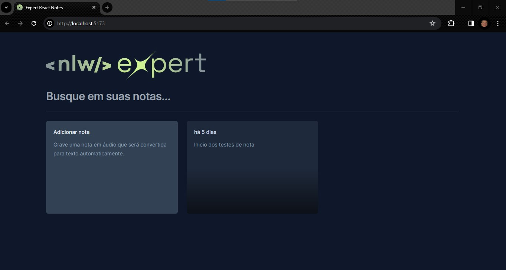
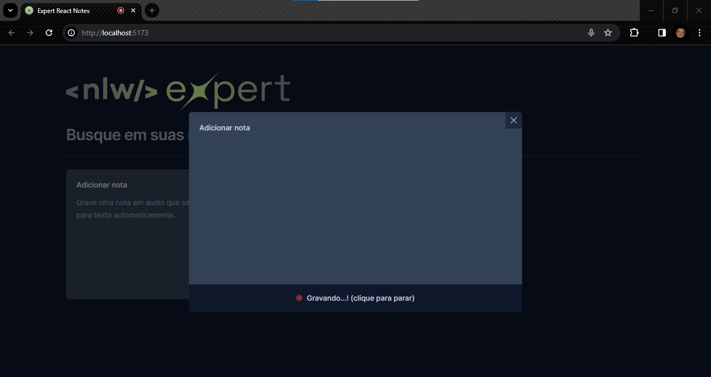
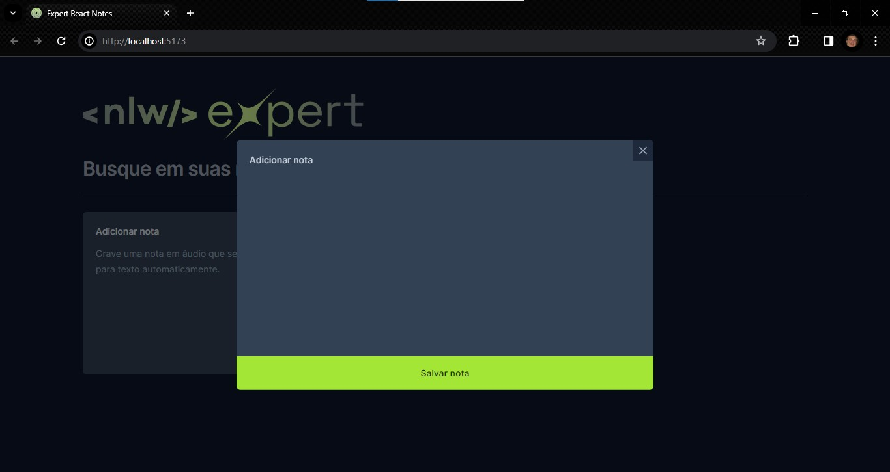

## Projeto Semana NLW - Expert
### Rocketseat – NLW – Expert – React.JS

#### Criação de uma aplicação para controle e geração de notas com React.JS

### 🔗 Links
[](https://github.com/ricardo-werner)

[](https://www.linkedin.com/in/ricardo-werner)

Status - Concluído

### Demonstração

Tela da Aplicação de Geração de Notas
<p align="center">
  
</p>

Tela da modal de opção de gravação ou digitação do texto
<p align="center">
  
</p>

<p align="center">
  
</p>

<p align="center">
  
</p>

Tela da com o modal com o novo card gerado
<p align="center">
  
</p>


### O Desafio
Neste projeto foi proposto criar uma aplicação de gerenciamento de notas, tanto por áudio como por digitação, com busca dinâmica e deleção de determinada nota de forma online codificado em React.JS.

### Requisitos da Aplicação

| Item  | Descrição                                            
| ----- | ---------------------------------------------------------------------- |
|  1    |  A aplicação deverá ser desenvolvida em React.JS.                           |
|  2    |  A aplicação deverá criar e deletar notas de texto                   |
|  3    |  Modelagem do layout, formatos, tipografias. cores e organização livre.|
|  4   |   A aplicação deverá ter a opção de criar nota por áudio ou digitação             |
|  5   |   A aplicação deverá ter um modal com os detalhes da nota gravada              |

### Plano do Projeto
No desenvolvimento desta aplicação, colocamos em prática:

| Item  | Descrição                                            
| ----- | ------------- |
|  1    |  HTML         |
|  2    |  CSS          |
|  3    |  JavaScript   |
|  3.1  |  React.JS        |
|  4    |  Skills       |

### Tecnologias utilizadas:

- Visual Studio Code
- NodeJS (compilação Vite - página oficial - https://vitejs.dev/ )

### Resultados

Dado que esta estrutura é ainda nova para mim, este projeto foi fundamental para aprimorar minha habilidade na utilização do React - um framework que se revelou flexível e escalável. Ao explorar suas ferramentas e bibliotecas, ganhei uma maior compreensão das estruturas de exportação e importação de componentes, da manipulação de props, além de ter explorado novas técnicas, como o uso do Sonner para configurar alertas e a integração da SpeechRecognitionAPI, permitindo a geração automática de textos a partir de áudio.
Além disso, a aplicação da biblioteca de ícones Lucide-React e a utilização do @radix-ui/react-dialog foram elementos enriquecedores. O @radix-ui/react-dialog, em particular, concentra-se na lógica de interação, destacando-se pela criação de modais, um desafio comum e crucial. Durante esse processo, foquei não apenas na implementação eficiente, mas também atendi aos requisitos de acessibilidade e explorei opções para personalização completa.
Este projeto proporcionou uma valiosa aprendizagem sobre a estruturação eficaz de uma aplicação, visando facilitar futuras manutenções.

## Para utilizar este projeto como base, faça o seguinte passo-a-passo:

Clone o projeto para a sua máquina
```bash
https://github.com/ricardo-werner/Rocketseat_NLW_Expert_ReactJS_Notes.git
```
Instale as dependências.
Nota - para rodar este comando é necessário ter instalado no computador o NodeJS e o Node Package Manager(NPM)

```bash
npm install
``` 
- Rode o projeto
```bash
npm run dev
```

## Autor

Ricardo Werner – Desenvolvedor em desenvolvimento

